<div align="center">

# Daily Check-in

[简体中文](README.md) | **English**

Self-hosted daily check-in for forums, portals and other sites that need a login. One-command Docker deploy, managed from a web UI.


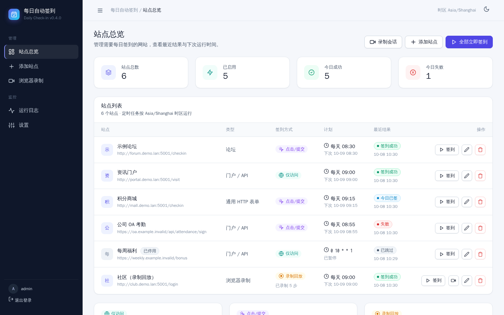

</div>

> The UI is in Chinese. Labels used below are given as **中文 (English)**.

## Contents

- [Features](#features)
- [Screenshots](#screenshots)
- [Quick start](#quick-start)
- [Check-in modes](#check-in-modes)
- [Recording guide](#recording-guide)
- [Configuration & environment variables](#configuration--environment-variables)
- [Troubleshooting](#troubleshooting)
- [Project structure](#project-structure)
- [Development & tests](#development--tests)
- [Security notes](#security-notes)
- [License](#license)

## Features

- **Web UI**: dashboard, add/edit sites, run logs and settings. Includes a dark mode and works in mobile browsers.
- **Three check-in modes**: visit, click (submit) and recorded (replay). See [Check-in modes](#check-in-modes).
- **Embedded browser recording**: Playwright Chromium is streamed into the page over noVNC. Log in and check in once, and the tool replays it automatically.
- **Scheduling**: APScheduler runs a daily time or a cron expression, in the Asia/Shanghai timezone.
- **Clear results**: status badges (success / already done today / failed / skipped), today's stats, next run time, and logs you can filter by status or site.
- **Login-protected**: session login via `CHECKIN_USER` / `CHECKIN_PASSWORD`. No management page and no noVNC stream is reachable without signing in.
- **Your data stays local**: sites, cookies and recordings live in the Docker volume `/data` (SQLite).
- **Works offline**: there is no frontend build step and no CDN. CSS, icons and noVNC are all bundled in the image.
- **No GitHub Actions**: it runs on your own machine, so you avoid the risk of abusing GitHub CI.
- **Extensible**: a pluggable adapter pattern (`forum` / `portal` / `http_form` / `browser`) lets you add your own.

## Screenshots

| Dashboard | Dark mode |
|---|---|
|  | 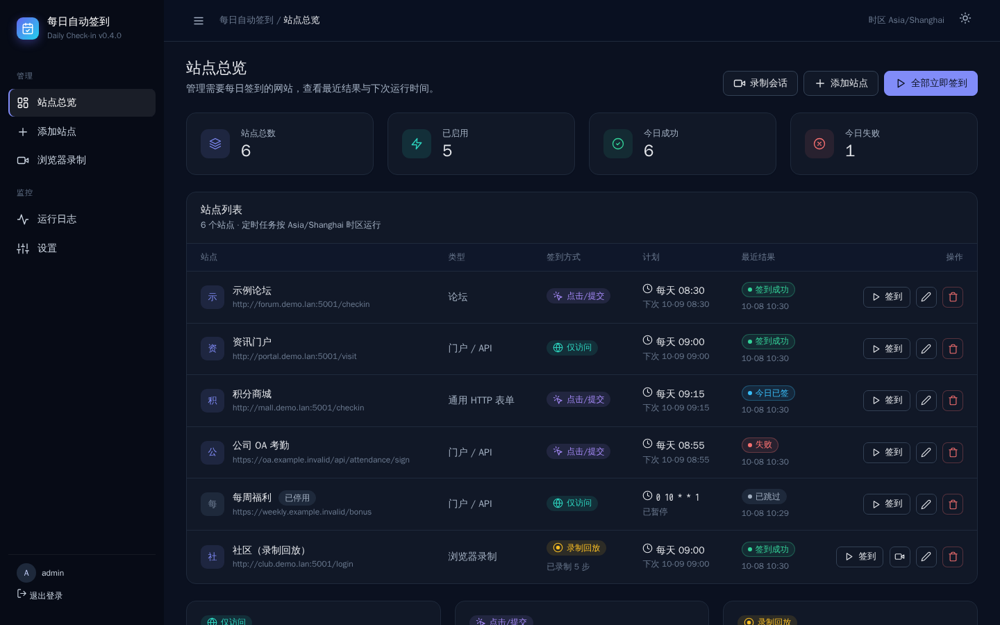 |
| **Add site (modes explained)** | **Run logs** |
| 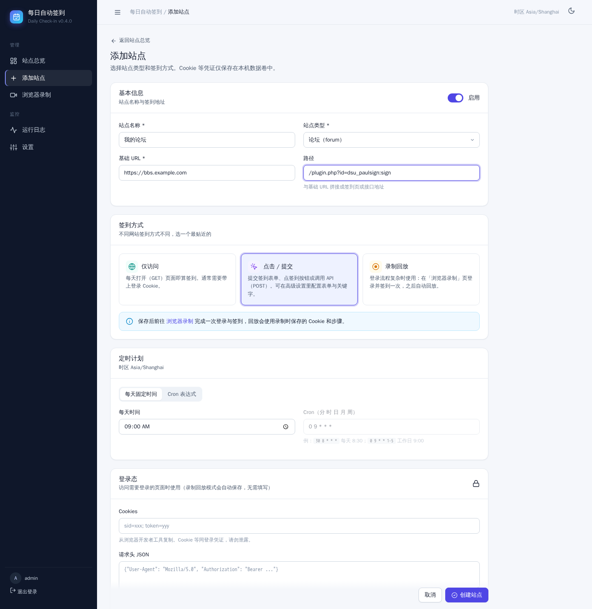 | 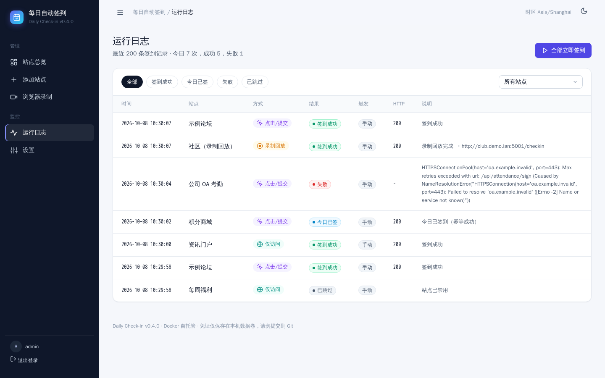 |
| **Browser recording** | **Recording session (remote browser via noVNC)** |
| 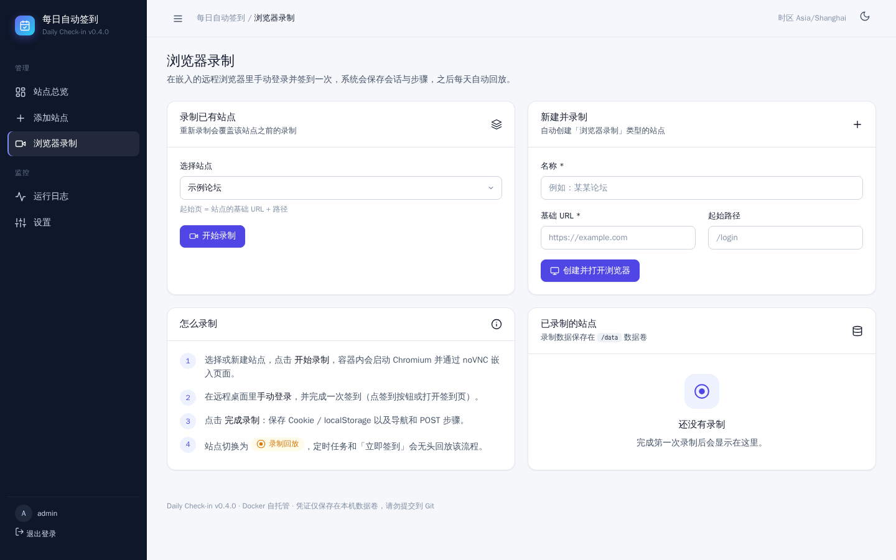 | 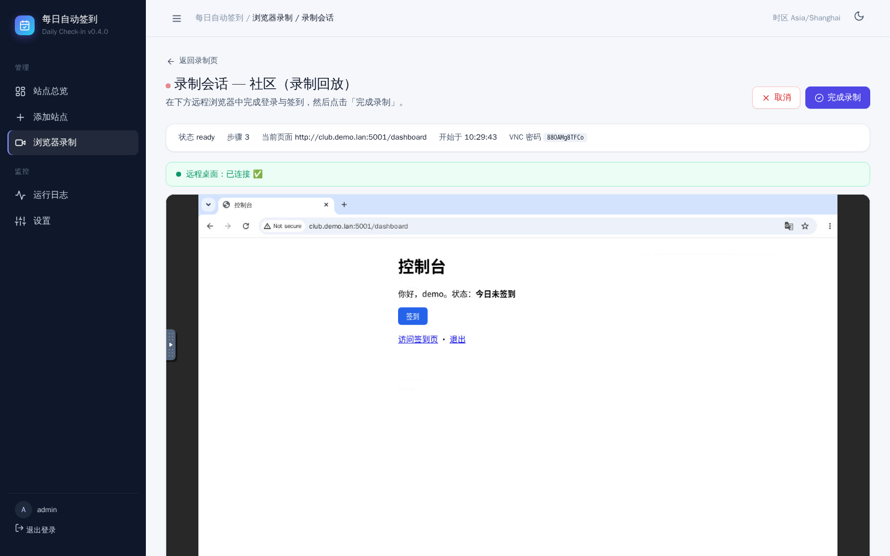 |
| **Login** | **Settings** |
| 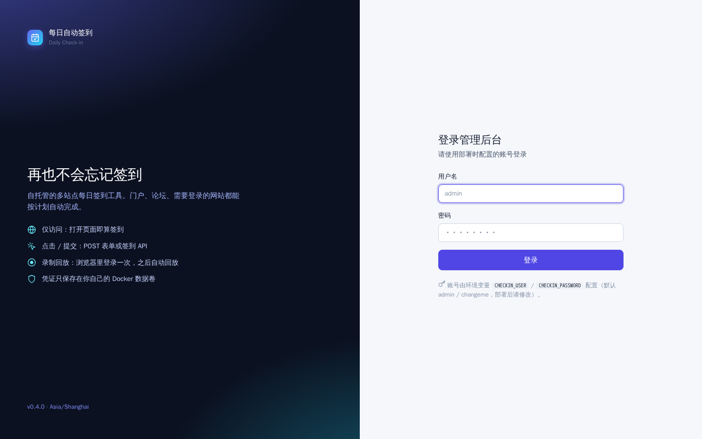 | 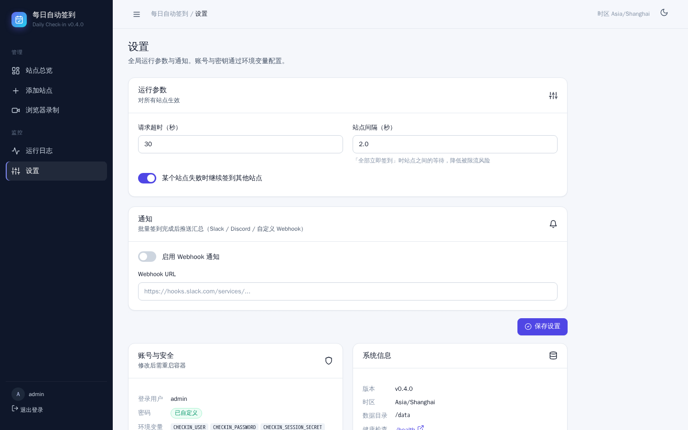 |

<details>
<summary>More: empty state, toast, mobile</summary>

| Empty state | Toast | Mobile |
|---|---|---|
| 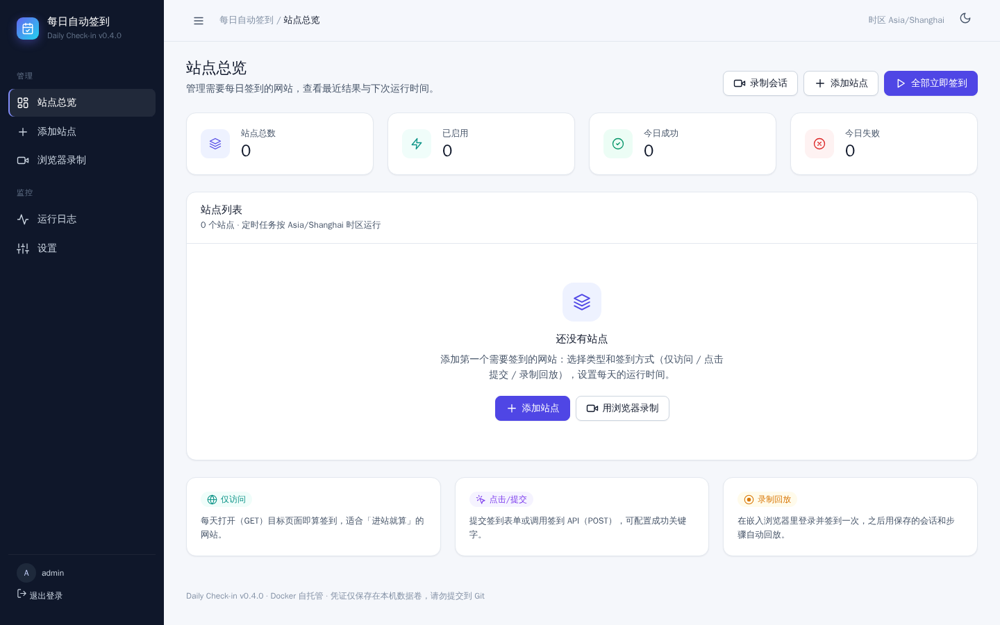 | 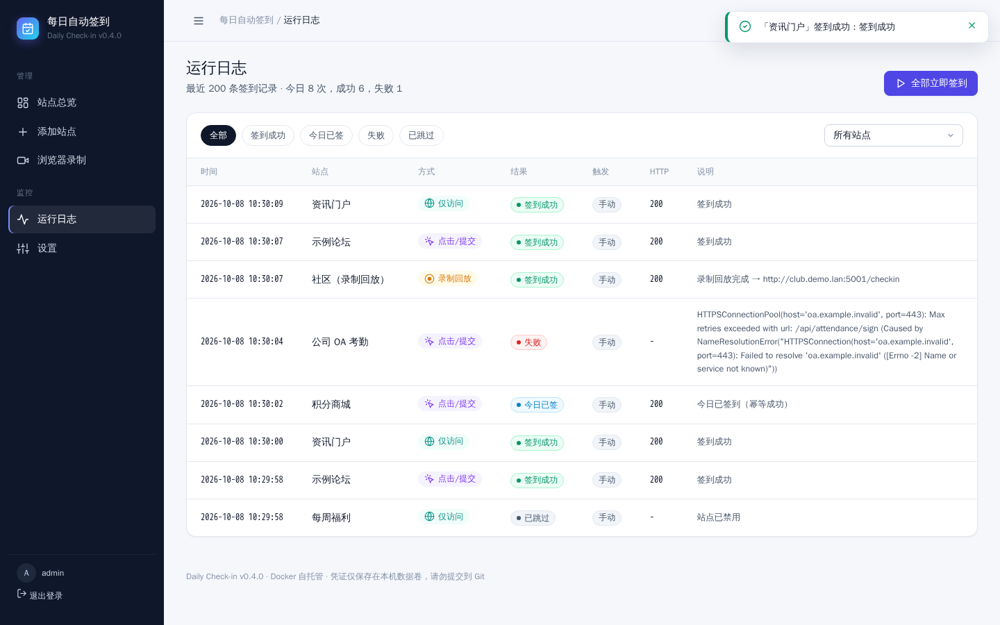 | 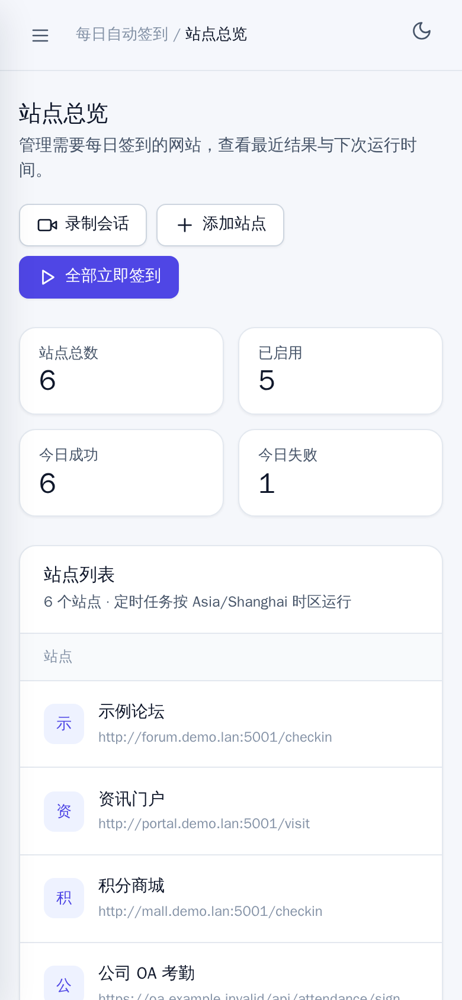 |

</details>

> Screenshots are generated automatically by [`docs/capture_screenshots.py`](docs/capture_screenshots.py), which runs Playwright against a running Docker instance.

## Quick start

Requires Docker with Docker Compose v2.

```bash
git clone https://github.com/WangShayne/daily-checkin.git
cd daily-checkin

# 1. Change the login credentials (strongly recommended)
cp .env.example .env
#   edit .env: CHECKIN_USER / CHECKIN_PASSWORD / CHECKIN_SESSION_SECRET

# 2. Build and start (the first build downloads Chromium and takes a while)
docker compose up -d --build
```

Open **http://localhost:4567**. From other devices on your LAN, use **http://<server-ip>:4567** (e.g. `http://192.168.1.10:4567`).

| Item | Value |
|---|---|
| Port | `4567` (web UI and the noVNC WebSocket share one port) |
| Default login | `admin` / `changeme`. **Change it before exposing the port.** The UI shows a warning while the default is in use. |
| Data volume | `checkin-data` → `/data` in the container (SQLite: sites, logs, recordings) |
| Demo site | `http://localhost:5001` (`demo` / `demo`, for self-testing; safe to remove) |

Restart after changing credentials:

```bash
CHECKIN_USER=me CHECKIN_PASSWORD='a-strong-password' \
CHECKIN_SESSION_SECRET="$(openssl rand -hex 32)" docker compose up -d
```

Common commands:

```bash
docker compose logs -f checkin        # follow logs
docker compose up -d --build          # rebuild after pulling updates (data is kept)
docker compose down                   # stop (the volume is kept)
```

**First steps**:

1. Log in.
2. Open **添加站点 (Add site)**.
3. Choose a type and a mode.
4. Set the daily time and save.
5. Click **签到 (Check in)** for a test run.
6. Check the result under **运行日志 (Run logs)**.

> If you don't need the demo site, remove the `test-site` service and the matching `depends_on` from `docker-compose.yml`.

## Check-in modes

| Mode | When to use | How it works | What you provide |
|---|---|---|---|
| **仅访问 (Visit)** `visit` | Opening the site/page each day counts as a check-in | Sends a GET to `base URL + path`. 2xx/3xx or a matching success keyword counts as success. | URL, usually a cookie |
| **点击 / 提交 (Click / submit)** `click` | The page has a check-in button, or there is a check-in API | Sends a POST (method configurable) with form data or JSON, depending on the site type | URL, cookie, optional form/JSON/success keywords |
| **录制回放 (Recorded)** `recorded` | Complex login (captcha, redirects, client-side crypto) | Record once in the embedded browser. Replay loads the saved cookies/localStorage and repeats the recent navigations plus the last POST. | Only a start URL; the rest happens on the [recording page](#recording-guide) |

How results are classified:

- **Already done today** (an idempotent success): the response contains 已签到 / 已经签到 / already / 重复签到.
- **Failed**: an exception occurred, or the status code is not in the success list.
- **Skipped**: the site is disabled.

The site type decides how a `click` request is submitted:

| Type | Use case |
|---|---|
| `forum` | Forum check-in plugins. The default form field is `operation=qiandao` (editable under advanced settings). |
| `portal` | JSON API check-in (`body`) or a form |
| `http_form` | Any form fields plus a cookie |
| `browser` | Browser recording; use it with the `recorded` mode |

## Recording guide

The container runs **Xvfb + x11vnc + Playwright Chromium**, embedded into the page via **noVNC**, so you control the remote browser right inside the UI.

1. Go to **浏览器录制 (Browser recording)** in the sidebar. Pick an existing site, or fill in a name and start URL (e.g. the login page) under 新建并录制 (Create & record).
2. The session page shows **远程桌面：已连接 ✅ (Remote desktop: connected)**.
3. **Log in manually** in the remote browser and **check in once** (click the button or open the check-in page).
4. Click **完成录制 (Finish recording)** at the top right. Cookies, localStorage (`storage_state`) and the navigation/POST steps are saved to `/data`.
5. The site switches to **recorded** mode. Scheduled runs and manual check-ins replay the flow headlessly from then on.

Tips:

- Only port 4567 needs to be open. x11vnc listens on `127.0.0.1:5900` inside the container only, and the app bridges `/ws/vnc` to it.
- The noVNC WebSocket URL is built from the browser's current address (same host, same port), so LAN-IP access works with no extra setup.
- Only one recording session runs at a time.
- If replay starts failing, the site's cookies have probably expired. Record again; the new recording overwrites the old one.

## Configuration & environment variables

| Variable | Default | Description |
|---|---|---|
| `CHECKIN_USER` | `admin` | Web UI username |
| `CHECKIN_PASSWORD` | `changeme` | Web UI password. **Change it.** |
| `CHECKIN_SESSION_SECRET` | compose: `please-change-this-session-secret` | Session cookie signing key; use a long random string |
| `CHECKIN_DATA_DIR` | `/data` (Docker), `./data` locally | SQLite data directory |
| `TZ` | `Asia/Shanghai` | Container timezone (schedules always use Asia/Shanghai) |
| `CHECKIN_DISPLAY` | `:99` | Xvfb display used for recording |
| `CHECKIN_VNC_PORT` | `5900` | x11vnc port inside the container (127.0.0.1 only) |
| `CHECKIN_VNC_READY_TIMEOUT` | `15` | Seconds to wait for x11vnc to become ready |
| `CHECKIN_XVFB_PID_FILE` | `/tmp/checkin-xvfb.pid` | Xvfb PID file, used to clean up stale processes |
| `PLAYWRIGHT_BROWSERS_PATH` | `/ms-playwright` | Playwright browser location (bundled in the image) |
| `TEST_SITE_URL` | `http://host.docker.internal:5001` | Used by the E2E scripts only |
| `CHECKIN_CONFIG` | `config.yaml` | YAML config, CLI mode only |

The **设置 (Settings)** page controls the request timeout, the delay between sites, whether to continue after a failure, and webhook notifications (Slack / Discord / custom).

## Troubleshooting

**Recording page says 「无法连接到服务器」 (cannot connect) or stays on "connecting"**

The chain is: `Xvfb :99` → `x11vnc 127.0.0.1:5900` → app `/ws/vnc` (port 4567) → noVNC in your browser.

1. Update and rebuild: `git pull && docker compose up -d --build`
2. Expand **连接诊断 (Connection diagnostics)** below the session, or open `http://<server-ip>:4567/api/record/diag` (login required):
   - in `processes`, Xvfb and x11vnc should both show `running: true`
   - `vnc_rfb_handshake: true` means x11vnc is healthy
   - `page_ws_url` should be `ws://<the address you browse>:4567/ws/vnc`
3. Check the logs with `docker compose logs -f checkin | grep -E "x11vnc|VNC WebSocket|录制"`. A healthy session logs `x11vnc 已就绪` (ready) and `VNC WebSocket 已连接` (connected).
4. Common causes:
   - Stale noVNC settings cached in the browser: use a private window, or clear localStorage for the site.
   - The session ended or your login expired: the WebSocket closes with 4404 / 4401. Go back to the recording page and start again.
   - An HTTPS reverse proxy: it must forward WebSocket upgrades (the `Upgrade` / `Connection` headers). https pages switch to `wss://` automatically.

**Other issues**

| Symptom | Fix |
|---|---|
| Broken styling | Hard refresh (Ctrl+F5). The stylesheet URL is versioned, so upgrades invalidate the cache. |
| Check-in fails with "Name or service not known" | The container can't resolve the domain; check DNS/network |
| Always "already done today" | The site reports today's check-in as already done; this is a normal idempotent success |
| Recorded replay fails | Cookies have likely expired; record the site again |
| Chromium crashes | Make sure `shm_size: 256mb` is still in the compose file |
| Scheduled run didn't happen | Make sure the site is enabled and check 下次 (next run) on the dashboard; the container must keep running |

## Project structure

```
daily-checkin/
├── Dockerfile               # python:3.12-slim + Chromium + Xvfb + x11vnc + noVNC
├── docker-compose.yml       # port 4567, data volume, login env vars, demo site
├── .env.example             # env template (copy to .env, never commit)
├── config.example.yaml      # CLI-mode example config
├── src/checkin/
│   ├── web/
│   │   ├── app.py           # FastAPI routes, login middleware, flash messages
│   │   ├── record_routes.py # recording pages, /ws/vnc WebSocket bridge, diagnostics
│   │   ├── templates/       # Jinja2 templates (base / dashboard / form / logs / settings / recording)
│   │   └── static/style.css # design system (light/dark, no external deps)
│   ├── adapters/            # forum / portal / http_form / recorded
│   ├── browser/recorder.py  # Xvfb + x11vnc + Playwright recording session
│   ├── db.py                # SQLite persistence
│   ├── scheduler.py         # APScheduler (Asia/Shanghai)
│   ├── core.py              # check-in orchestration
│   └── models.py            # models, mode/type labels
├── examples/
│   ├── test-site/           # Flask demo check-in site (demo / demo)
│   ├── e2e_against_test_site.py
│   └── e2e_record_ui.py     # end-to-end test of the noVNC recording UI
├── docs/
│   ├── screenshots/         # README screenshots
│   └── capture_screenshots.py
└── tests/                   # pytest unit tests
```

## Development & tests

Run locally without Docker (recording also needs Xvfb, x11vnc and noVNC):

```bash
python3 -m venv .venv && source .venv/bin/activate
pip install -r requirements.txt && pip install -e ".[dev]"
playwright install chromium
export CHECKIN_DATA_DIR=./data CHECKIN_USER=admin CHECKIN_PASSWORD=changeme
uvicorn checkin.web.app:app --host 0.0.0.0 --port 4567 --reload
```

Unit tests:

```bash
pytest -q
```

End-to-end tests (with the Docker stack running):

```bash
# visit / click / recorded against the demo site
docker exec -e TEST_SITE_URL=http://host.docker.internal:5001 \
  daily-checkin python /app/examples/e2e_against_test_site.py

# Recording UI: login → noVNC connects → log in & check in inside the remote browser → finish
# Set UI_URL to a LAN IP to verify non-localhost access
docker run --rm --network host --shm-size 256m -v "$PWD/examples:/ex" \
  -e UI_URL=http://127.0.0.1:4567 -e TARGET_URL=http://host.docker.internal:5001 \
  daily-checkin-checkin python /ex/e2e_record_ui.py
```

To regenerate the screenshots, follow the header of [`docs/capture_screenshots.py`](docs/capture_screenshots.py). Use a demo container with a fresh volume.

Frontend notes: pages are server-rendered with FastAPI + Jinja2, with no npm or build step. Styles live in `static/style.css`; icons are inline SVGs in `_macros.html`.

CLI mode (YAML config, handy for debugging): `cp config.example.yaml config.yaml && checkin -c config.yaml -v`

## Security notes

- **Change the default password.** `admin / changeme` is only for a first try. Also set a random `CHECKIN_SESSION_SECRET`.
- **Don't expose it directly to the internet.** LAN use is recommended. For remote access, put it behind an HTTPS reverse proxy or a VPN.
- **Cookies are as good as passwords.** Site cookies and recorded `storage_state` live in the `/data` volume. Never commit or share the volume or `checkin.db`.
- **Never commit** `.env`, `config.yaml`, database files or exported cookies (they are already in `.gitignore`).
- **No GitHub Actions.** The project is meant to be self-hosted; don't run check-ins in CI.
- noVNC and `/ws/vnc` require login too, and x11vnc listens on the container's loopback only.

## Disclaimer

For personal automation and learning only. Follow the target sites' terms of service and local laws, and do not use it for unauthorized access. Examples in this repo use placeholder URLs and the local demo site only.

## License

MIT
