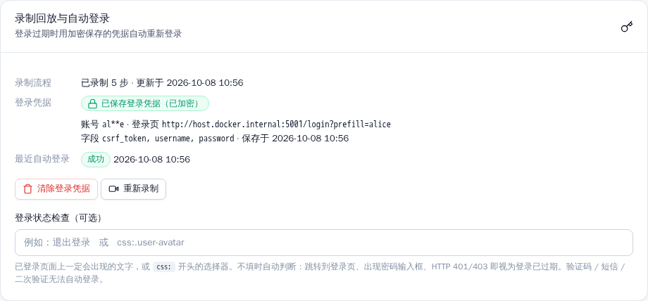

<div align="center">

# Daily Check-in · 多站点每日自动签到

**简体中文** | [English](README.en.md)

自托管的每日签到工具：Docker 一键部署，通过网页管理论坛、门户、需要登录的网站的每日签到。


</div>

## 目录

- [功能特性](#功能特性)
- [界面截图](#界面截图)
- [快速开始](#快速开始)
- [签到方式](#签到方式)
- [浏览器录制指南](#浏览器录制指南)
- [登录过期自动重新登录与凭据加密](#登录过期自动重新登录与凭据加密)
- [配置与环境变量](#配置与环境变量)
- [故障排查](#故障排查)
- [项目结构](#项目结构)
- [开发与测试](#开发与测试)
- [安全须知](#安全须知)
- [License](#license)

## 功能特性

- **可视化管理**：站点总览、添加 / 编辑站点、运行日志、设置，全中文界面，支持深色模式和手机浏览器
- **三种签到方式**：仅访问（visit）、点击 / 提交（click）、录制回放（recorded），详见[签到方式](#签到方式)
- **嵌入式浏览器录制**：Playwright Chromium + noVNC 嵌入页面，手动登录并签到一次，之后自动回放
- **登录过期自动重新登录**：回放时发现 Cookie 失效，自动用**加密保存**的密码重新登录（每次重新获取 CSRF Token），再完成签到
- **敏感信息脱敏**：录制的请求中密码、Token、CSRF、Cookie、手机号、身份证号等字段一律以 `***` 保存，日志同样脱敏
- **定时执行**：APScheduler，每天固定时间或 Cron 表达式，时区 Asia/Shanghai
- **结果一目了然**：状态徽章（签到成功 / 今日已签 / 失败 / 已跳过）、今日统计、下次运行时间、按状态 / 站点筛选日志
- **登录保护**：会话登录（`CHECKIN_USER` / `CHECKIN_PASSWORD`），未登录无法访问任何管理页面或 noVNC
- **数据只在本机**：站点、Cookie、录制会话都保存在 Docker 数据卷 `/data`（SQLite）
- **离线可用**：前端无构建步骤、不依赖 CDN，CSS / 图标 / noVNC 全部打包在镜像内
- **不使用 GitHub Actions**：在你自己的机器上运行，避免滥用 GitHub 的风险
- **可扩展**：Adapter 插件模式（`forum` / `portal` / `http_form` / `browser`），可自行添加

## 界面截图

| 站点总览 | 深色模式 |
|---|---|
|  |  |
| **添加站点（签到方式说明）** | **运行日志** |
|  |  |
| **浏览器录制** | **录制会话（noVNC 远程浏览器）** |
|  |  |
| **登录** | **设置** |
|  |  |

<details>
<summary>更多截图：空状态、操作提示、手机端</summary>

| 空状态 | 操作提示（Toast） | 手机端 |
|---|---|---|
|  |  |  |

**站点编辑页：已保存登录凭据（已加密）**



</details>

> 截图由 [`docs/capture_screenshots.py`](docs/capture_screenshots.py) 用 Playwright 对运行中的 Docker 实例自动生成。

## 快速开始

需要 Docker 和 Docker Compose v2。

```bash
git clone https://github.com/WangShayne/daily-checkin.git
cd daily-checkin

# 1. 修改登录账号（强烈建议）
cp .env.example .env
#   编辑 .env：CHECKIN_USER / CHECKIN_PASSWORD / CHECKIN_SESSION_SECRET

# 2. 构建并启动（首次会下载 Chromium，稍慢）
docker compose up -d --build
```

浏览器打开 **http://localhost:4567**，在局域网其他设备上用 **http://<服务器 IP>:4567** 访问（例如 `http://192.168.1.10:4567`）。

| 项目 | 值 |
|---|---|
| 端口 | `4567`（Web UI + noVNC WebSocket，同一端口） |
| 默认账号 | `admin` / `changeme`（**对外暴露前务必修改**，未修改时页面会显示警告） |
| 数据卷 | `checkin-data` → 容器内 `/data`（SQLite：站点、日志、录制会话） |
| 示例站 | `http://localhost:5001`（`demo` / `demo`，用于自测，可删除） |

修改账号后重启生效：

```bash
CHECKIN_USER=me CHECKIN_PASSWORD='a-strong-password' \
CHECKIN_SESSION_SECRET="$(openssl rand -hex 32)" docker compose up -d
```

常用命令：

```bash
docker compose logs -f checkin        # 查看日志
docker compose up -d --build          # 更新代码后重建（数据保留）
docker compose down                   # 停止（数据卷保留）
```

**上手流程**：登录 → **添加站点** → 选类型和签到方式 → 设置每天时间 → 保存 → 点 **签到** 试跑 → 在 **运行日志** 查看结果。

> 不需要示例站时，可以删除 `docker-compose.yml` 里的 `test-site` 服务和 `depends_on`。

## 签到方式

| 方式 | 适用场景 | 工作原理 | 需要填写 |
|---|---|---|---|
| **仅访问** `visit` | 每天打开网站 / 某页面就算签到 | 对 `基础 URL + 路径` 发 GET 请求，2xx / 3xx 或命中成功关键字即成功 | URL、通常需要 Cookie |
| **点击 / 提交** `click` | 页面上有「签到」按钮，或有签到 API | 按站点类型发 POST（可改方法），提交表单或 JSON | URL、Cookie、可选表单 / JSON / 成功关键字 |
| **录制回放** `recorded` | 登录流程复杂（跳转、前端加密、Cookie 经常过期） | 在嵌入浏览器里录制一次；回放时加载保存的 Cookie / localStorage，打开录制的页面并重新提交签到表单；登录过期时[自动重新登录](#登录过期自动重新登录与凭据加密) | 只需起始 URL，在[录制页](#浏览器录制指南)完成 |

结果判定：响应中含「已签到 / 已经签到 / already / 重复签到」记为 **今日已签**（幂等成功）；请求异常或状态码不在成功列表内记为 **失败**；站点停用时记为 **已跳过**。

站点类型（决定 click 时如何提交）：

| 类型 | 适用场景 |
|---|---|
| `forum` 论坛 | 论坛签到插件，默认表单字段 `operation=qiandao`（可在高级设置修改） |
| `portal` 门户 / API | JSON API 签到（`body`）或表单 |
| `http_form` 通用 HTTP 表单 | 任意表单字段 + Cookie |
| `browser` 浏览器录制 | 配合 `recorded` 方式使用 |

## 浏览器录制指南

容器内运行 **Xvfb + x11vnc + Playwright Chromium**，通过 **noVNC** 嵌入网页，你可以直接在页面中操作远程浏览器。

1. 左侧导航 **浏览器录制**，选择已有站点，或在「新建并录制」中填写名称和起始 URL（例如登录页）
2. 进入录制会话后，状态栏显示 **远程桌面：已连接 ✅**
3. 在远程浏览器中**手动登录**，并**完成一次签到**（点击签到按钮或打开签到页）
4. 点击右上角 **完成录制**，保存 Cookie / localStorage（`storage_state`）和导航 / POST 步骤到 `/data`
5. 站点自动切换为 **录制回放**，之后的定时任务和「立即签到」都会无头回放

提示：

- 只需放行 4567 端口；x11vnc 只监听容器内 `127.0.0.1:5900`，应用在 `/ws/vnc` 把 WebSocket 桥接到 VNC
- noVNC 的 WebSocket 地址由浏览器当前地址生成（同主机、同端口），用局域网 IP 访问无需额外配置
- 同一时间只能有一个录制会话；重新录制会覆盖旧录制
- 录制时**请从登录页开始，完成一次登录 + 签到**，这样系统才能识别登录步骤并在 Cookie 过期后自动重新登录

## 登录过期自动重新登录与凭据加密

**工作原理**

1. **录制时识别登录**：POST 请求中含 `password` / `passwd` / `pwd` / `pass` / `secret` 等字段，或提交的表单里有 `type=password` 输入框，即标记为登录步骤，记录登录页地址、提交地址、字段名
2. **只加密密码**：密码类字段用 Fernet（AES-128-CBC + HMAC-SHA256）加密后存入 SQLite 的 `login_credentials` 表；用户名明文保存（界面中打码显示）。数据库、日志、页面、诊断接口里都不会出现明文密码
3. **其余请求全部脱敏**：`token`、`access_token`、`csrf`、`_token`、`authenticity_token`、`formhash`、`session`、`cookie`、`authorization`、`api_key`、`otp` / `code`、手机号、身份证号、邮箱等字段保存为 `***`（支持表单、JSON、multipart）。CSRF Token 每次会话都不同，回放时从页面重新获取，不使用录制时的旧值
4. **回放时检测登录过期**：恢复 Cookie 并打开录制的页面后，出现以下任一情况即判定登录已过期：跳转到录制时的登录页、页面出现密码输入框、HTTP 401 / 403、或未满足站点设置的「登录状态检查」
5. **自动重新登录**（每次运行最多 1 次）：打开录制的登录页，在真实页面中填入用户名和解密后的密码并提交（自动带上新的 CSRF Token）；页面上找不到表单时，退回为抓取新 CSRF 后直接 POST
6. 登录成功后把**新的 Cookie / localStorage 写回数据库**，再执行签到；日志显示「登录已过期，已自动重新登录」
7. 重新登录失败（验证码、短信、二次验证、密码已修改）时，本次记为失败，提示重新录制

**站点设置**（编辑站点 → 选择「录制回放」）：

- 显示「已保存登录凭据（已加密）」、登录页、最近一次自动登录的时间和结果，**不会显示密码**
- 「清除登录凭据」删除已加密的密码
- 「登录状态检查（可选）」：已登录页面上一定会出现的文字（如 `退出登录`），或 `css:.user-avatar` 这样的选择器。默认的自动判断不准确时再填写

**加密密钥**

| 方式 | 说明 |
|---|---|
| 环境变量 `CHECKIN_SECRET_KEY`（推荐） | 用 `python -c "from cryptography.fernet import Fernet; print(Fernet.generate_key().decode())"` 生成；也可以填任意长字符串（会自动派生密钥） |
| 自动生成 `/data/secret.key` | 未设置环境变量时，首次启动自动生成（权限 0600），日志会提示备份 |

- **请备份密钥**：密钥丢失或更换后，已保存的密码无法解密（会提示重新录制），录制的 Cookie 和步骤不受影响
- 备份 / 迁移数据卷时请把 `secret.key` 与 `checkin.db` **分开保管**，或者用环境变量提供密钥、不放在卷里
- 从旧版本升级时，启动会**自动迁移一次**：把旧录制中明文保存的密码 / Token 改为 `***`，能识别出登录步骤的会加密保存其密码，并整理（VACUUM）数据库文件，清掉残留的明文

**限制**

- 需要**图形验证码、短信验证码、扫码、二次验证（2FA）**的站点无法自动登录，只能在 Cookie 过期后重新录制
- 登录页结构变化过大（字段改名、改成多步登录）时自动登录可能失败，重新录制即可
- 单点登录 / 第三方 OAuth 登录（跳转到别的域名）只做最大努力

## 配置与环境变量

| 变量 | 默认值 | 说明 |
|---|---|---|
| `CHECKIN_USER` | `admin` | Web UI 登录用户名 |
| `CHECKIN_PASSWORD` | `changeme` | Web UI 登录密码，**务必修改** |
| `CHECKIN_SESSION_SECRET` | compose：`please-change-this-session-secret` | 会话 Cookie 签名密钥，请换成随机长字符串 |
| `CHECKIN_SECRET_KEY` | 未设置时自动生成 `/data/secret.key` | 加密已保存登录密码的密钥（Fernet key 或任意长字符串），**请备份** |
| `CHECKIN_DATA_DIR` | `/data`（Docker），本地默认 `./data` | SQLite 数据目录 |
| `TZ` | `Asia/Shanghai` | 容器时区（定时任务固定按 Asia/Shanghai） |
| `CHECKIN_DISPLAY` | `:99` | 录制用 Xvfb 显示号 |
| `CHECKIN_VNC_PORT` | `5900` | 容器内 x11vnc 端口（仅 127.0.0.1） |
| `CHECKIN_VNC_READY_TIMEOUT` | `15` | 等待 x11vnc 就绪的秒数 |
| `CHECKIN_XVFB_PID_FILE` | `/tmp/checkin-xvfb.pid` | Xvfb PID 文件，用于清理残留进程 |
| `PLAYWRIGHT_BROWSERS_PATH` | `/ms-playwright` | Playwright 浏览器目录（镜像内置） |
| `TEST_SITE_URL` | `http://host.docker.internal:5001` | 仅 E2E 脚本使用 |
| `CHECKIN_CONFIG` | `config.yaml` | 仅 CLI 模式使用的 YAML 配置 |

网页 **设置** 页可修改：请求超时、站点间隔、失败后是否继续、Webhook 通知（Slack / Discord / 自定义）。

## 故障排查

**录制页「无法连接到服务器」/ 一直连接中**

链路：`Xvfb :99` → `x11vnc 127.0.0.1:5900` → 应用 `/ws/vnc`（4567 端口）→ 浏览器中的 noVNC。

1. 先更新并重建镜像：`git pull && docker compose up -d --build`
2. 展开录制页下方 **连接诊断**，或访问 `http://<服务器IP>:4567/api/record/diag`（需登录）：
   - `processes` 中 Xvfb / x11vnc 应为 `running: true`
   - `vnc_rfb_handshake: true` 表示 x11vnc 正常
   - `page_ws_url` 应为 `ws://<你访问的地址>:4567/ws/vnc`
3. 查看日志：`docker compose logs -f checkin | grep -E "x11vnc|VNC WebSocket|录制"`，正常会出现 `x11vnc 已就绪` 和 `VNC WebSocket 已连接`
4. 常见原因：
   - 浏览器缓存了旧 noVNC 设置：换无痕窗口或清除该站点 localStorage
   - 会话已结束 / 登录过期：WebSocket 以 4404 / 4401 关闭，回到录制页重新开始
   - HTTPS 反向代理：需转发 WebSocket（`Upgrade` / `Connection` 头），https 页面会自动使用 `wss://`

**其他问题**

| 现象 | 处理 |
|---|---|
| 页面样式错乱 | 强制刷新（Ctrl+F5）；样式文件带版本号，升级后会自动失效 |
| 签到失败「Name or service not known」 | 容器无法解析该域名，检查 DNS / 网络 |
| 一直「今日已签」 | 说明站点判定今天已签过，属于正常的幂等成功 |
| 录制回放失败 / 登录已过期 | 录制时包含登录步骤即可自动重新登录；未保存凭据或需要验证码的站点请重新录制 |
| 「无法解密已保存的登录凭据」 | 加密密钥已更换或丢失（`CHECKIN_SECRET_KEY` / `secret.key`），恢复原密钥或重新录制 |
| 「自动重新登录失败：…验证码…」 | 站点需要验证码 / 短信 / 二次验证，无法自动登录，请重新录制 |
| 已登录却被判定为「登录已过期」 | 在站点设置中填写「登录状态检查」，例如 `退出登录` 或 `css:.avatar` |
| Chromium 崩溃 | 确认 compose 中 `shm_size: 256mb` 未被删除 |
| 定时没有执行 | 确认站点已启用，在总览页查看「下次运行」时间；容器需保持运行 |

## 项目结构

```
daily-checkin/
├── Dockerfile               # python:3.12-slim + Chromium + Xvfb + x11vnc + noVNC
├── docker-compose.yml       # 端口 4567、数据卷、登录环境变量、示例站
├── .env.example             # 环境变量模板（复制为 .env，勿提交）
├── config.example.yaml      # CLI 模式示例配置
├── src/checkin/
│   ├── web/
│   │   ├── app.py           # FastAPI 路由、登录中间件、Flash 提示
│   │   ├── record_routes.py # 录制页面、/ws/vnc WebSocket 桥接、诊断接口
│   │   ├── templates/       # Jinja2 模板（base / 总览 / 表单 / 日志 / 设置 / 录制）
│   │   └── static/style.css # 设计系统（浅色 / 深色，无外部依赖）
│   ├── adapters/            # forum / portal / http_form / recorded（回放 + 自动重新登录）
│   ├── browser/recorder.py  # Xvfb + x11vnc + Playwright 录制会话
│   ├── browser/flow.py      # 登录识别、回放计划、登录过期检测、CSRF 获取
│   ├── crypto.py            # Fernet 加密（CHECKIN_SECRET_KEY / secret.key）
│   ├── redact.py            # 请求 / URL / 日志脱敏
│   ├── db.py                # SQLite 持久化
│   ├── scheduler.py         # APScheduler（Asia/Shanghai）
│   ├── core.py              # 签到编排
│   └── models.py            # 数据模型、签到方式 / 类型标签
├── examples/
│   ├── test-site/           # Flask 自测签到站（demo / demo，登录 CSRF，/admin/expire）
│   ├── e2e_against_test_site.py
│   ├── e2e_record_ui.py     # noVNC 录制 UI 端到端测试
│   └── e2e_relogin.py       # 录制 → 会话过期 → 自动重新登录 → 签到
├── docs/
│   ├── screenshots/         # README 截图
│   └── capture_screenshots.py
└── tests/                   # pytest 单元测试
```

## 开发与测试

本地运行（不使用 Docker，录制功能需要 Xvfb / x11vnc / noVNC）：

```bash
python3 -m venv .venv && source .venv/bin/activate
pip install -r requirements.txt && pip install -e ".[dev]"
playwright install chromium
export CHECKIN_DATA_DIR=./data CHECKIN_USER=admin CHECKIN_PASSWORD=changeme
uvicorn checkin.web.app:app --host 0.0.0.0 --port 4567 --reload
```

单元测试：

```bash
pytest -q
```

端到端测试（Docker 运行中）：

```bash
# visit / click / recorded 三种方式对示例站
docker exec -e TEST_SITE_URL=http://host.docker.internal:5001 \
  daily-checkin python /app/examples/e2e_against_test_site.py

# 录制 UI：登录 → noVNC 连接 → 远程浏览器登录签到 → 完成录制
# UI_URL 可换成局域网 IP，验证非 localhost 访问
docker run --rm --network host --shm-size 256m -v "$PWD/examples:/ex" \
  -e UI_URL=http://127.0.0.1:4567 -e TARGET_URL=http://host.docker.internal:5001 \
  daily-checkin-checkin python /ex/e2e_record_ui.py
```

登录过期自动重新登录（录制 alice 账号 → `POST /admin/expire` 让示例站会话失效 → 回放必须自动登录并签到），之后检查数据卷和日志中没有明文密码：

```bash
docker run --rm --network host --shm-size 256m -v "$PWD/examples:/ex" \
  -e UI_URL=http://127.0.0.1:4567 -e TARGET_URL=http://host.docker.internal:5001 \
  -e TEST_SITE_LOCAL=http://127.0.0.1:5001 daily-checkin-checkin python /ex/e2e_relogin.py
docker exec daily-checkin grep -rlF 'Wonderland-2026!' /data || echo "no plaintext"
```

示例站：登录表单带 CSRF Token；`POST /admin/expire` 让所有会话失效；`SESSION_LIFETIME=秒` 可设置会话有效期；`/login?prefill=alice` 预填第二个账号。

重新生成截图见 [`docs/capture_screenshots.py`](docs/capture_screenshots.py) 顶部说明（建议使用全新数据卷的演示容器）。

前端说明：服务端渲染（FastAPI + Jinja2），没有 npm / 构建步骤；样式在 `static/style.css`，图标是 `_macros.html` 中的内联 SVG。

CLI 模式（YAML 配置，适合调试）：`cp config.example.yaml config.yaml && checkin -c config.yaml -v`

## 安全须知

- **修改默认密码**：`admin / changeme` 仅供首次试用；同时设置随机的 `CHECKIN_SESSION_SECRET`
- **不要直接暴露到公网**：建议只在局域网使用；如需外网访问，请放在 HTTPS 反向代理 / VPN 之后
- **Cookie 等同于账号**：站点 Cookie、录制的 `storage_state` 存在 `/data` 数据卷，切勿提交或分享数据卷 / `checkin.db`
- **登录密码加密保存**：只有密码类字段被加密，密钥来自 `CHECKIN_SECRET_KEY` 或 `/data/secret.key`（0600）。拿到数据库 + 密钥的人可以解密，所以两者请分开保管、做好备份
- **脱敏**：录制的其他请求、URL 参数、运行日志、应用日志中的敏感字段都会替换为 `***`
- **切勿提交**：`.env`、`config.yaml`、数据库文件、导出的 Cookie（已在 `.gitignore` 中排除）
- **不使用 GitHub Actions**：本项目设计为自托管运行，不要把签到放到 CI 中
- noVNC 和 `/ws/vnc` 同样需要登录；x11vnc 只监听容器内回环地址

## 免责声明

本项目仅供个人自动化学习与自用。请遵守目标网站的服务条款和当地法律，不得用于未授权访问。仓库示例只使用占位 URL 和本地示例站。

## License

MIT
